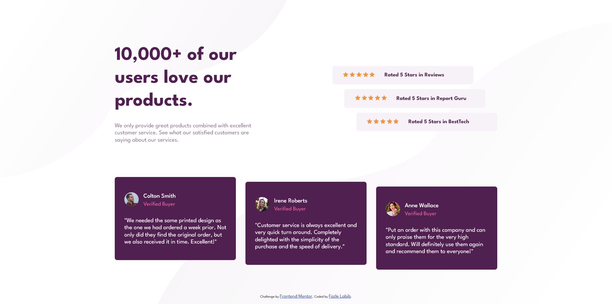
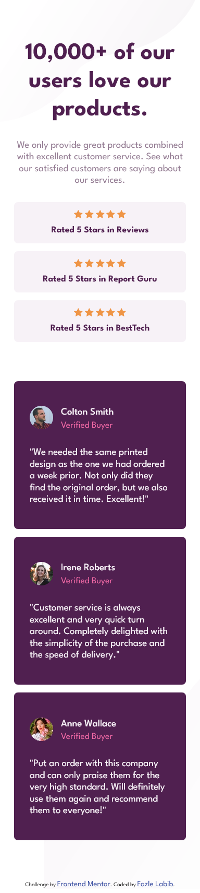

# Frontend Mentor - Social proof section solution

This is a solution to the [Social proof section challenge on Frontend Mentor](https://www.frontendmentor.io/challenges/social-proof-section-6e0qTv_bA). Frontend Mentor challenges help you improve your coding skills by building realistic projects. 

## Table of contents

- [Overview](#overview)
  - [The challenge](#the-challenge)
  - [Screenshot](#screenshot)
  - [Links](#links)
- [My process](#my-process)
  - [Built with](#built-with)
  - [What I learned](#what-i-learned)
  - [Useful resources](#useful-resources)
- [Author](#author)

## Overview

### The challenge

Users should be able to:

- View the optimal layout for the section depending on their device's screen size

### Screenshot




### Links

- Solution URL: [https://github.com/FazleLabib/frontend-mentor-social-proof-section](https://github.com/FazleLabib/frontend-mentor-social-proof-section)
- Live Site URL: [https://fazlelabib.github.io/frontend-mentor-social-proof-section](https://fazlelabib.github.io/frontend-mentor-social-proof-section)

## My process

### Built with

- Semantic HTML5 markup
- CSS custom properties
- Flexbox
- CSS Grid
- Mobile-first workflow

### What I learned

Learned how to add multiple images as background images. Also figured out how to play with positioning of divs. I was able to position the rating cards and the review cards by manipulating the margins as shown in the given css code.


<!-- ```html
<h1>Some HTML code I'm proud of</h1>
``` -->
```css
body {
    display: flex;
    flex-direction: column;
    justify-content: center;
    align-items: center;
    min-height: 100vh;
    
    background-image: url(./images/bg-pattern-top-desktop.svg), url(./images/bg-pattern-bottom-desktop.svg);
    background-size: 60rem, 95rem;
    background-position: top left, bottom right;
    background-repeat: no-repeat, no-repeat;
}

#c-2 {
    margin-bottom: -1rem;
    margin-top: 1rem;
}

#c-3 {
    margin-bottom: -2rem;
    margin-top: 2rem;
}

```
<!-- ```js
const proudOfThisFunc = () => {
  console.log('🎉')
}
``` -->

### Useful resources

- [CSS3 Backgrounds](https://www.w3schools.com/css/css3_backgrounds.asp) - This helped me use multiple images as the background image.

## Author


- Frontend Mentor - [@FazleLabib](https://www.frontendmentor.io/profile/FazleLabib)
